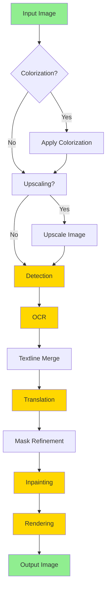
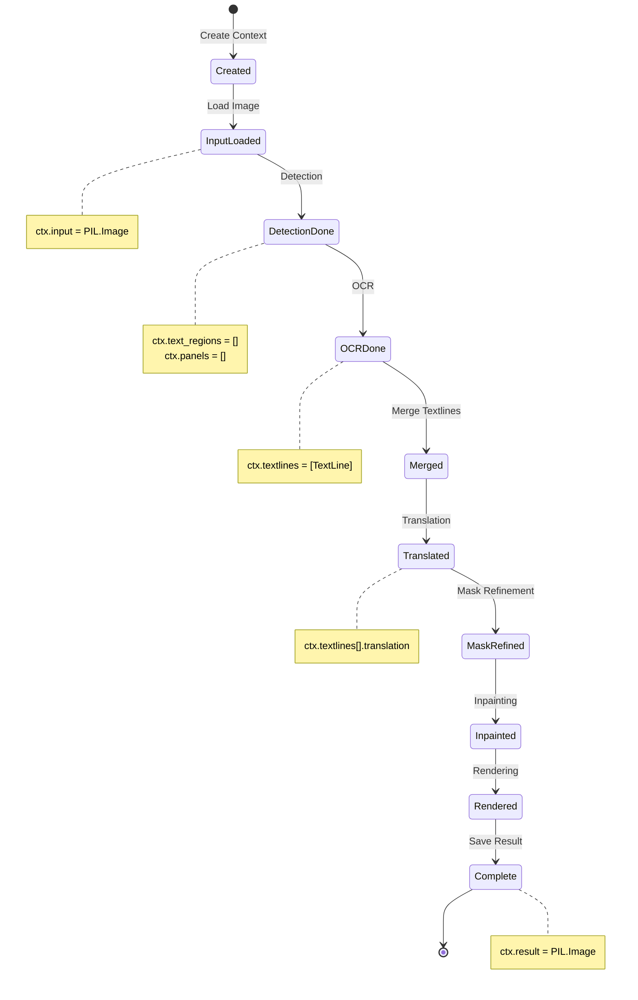
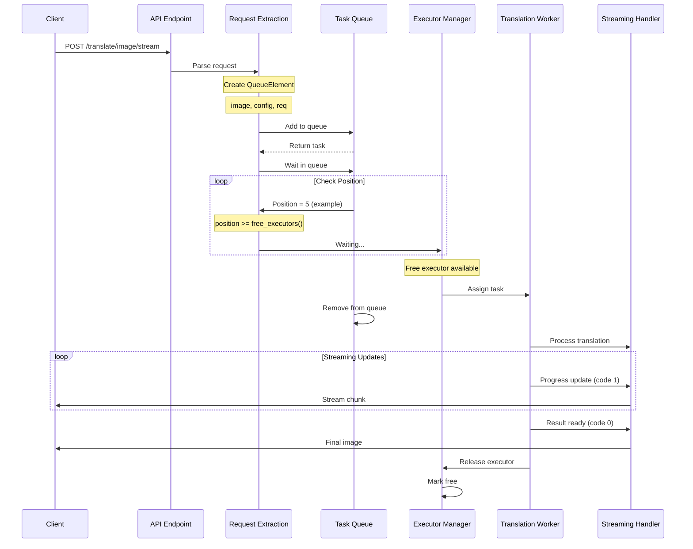
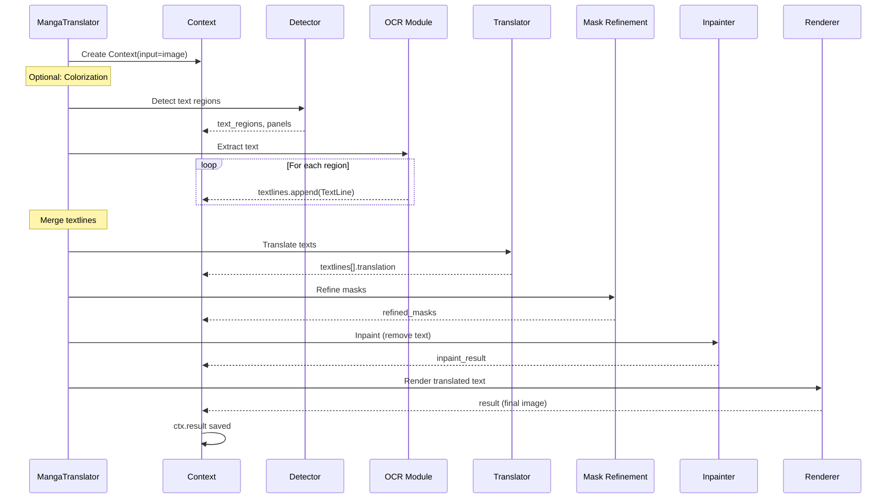
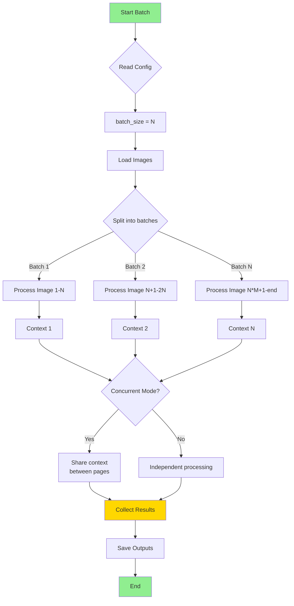
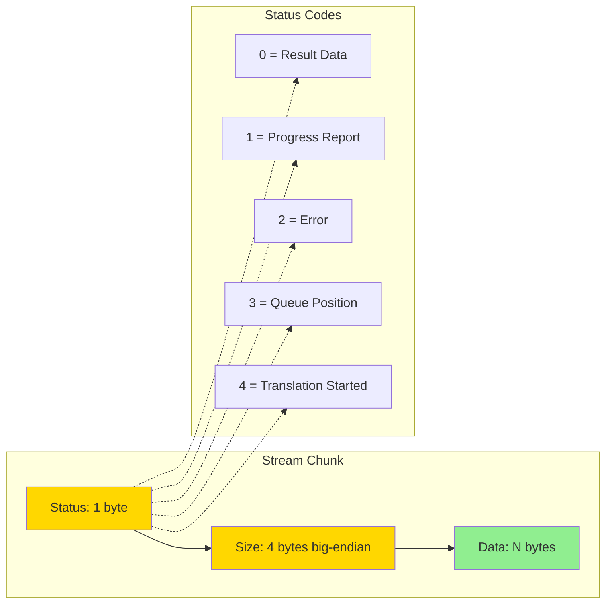
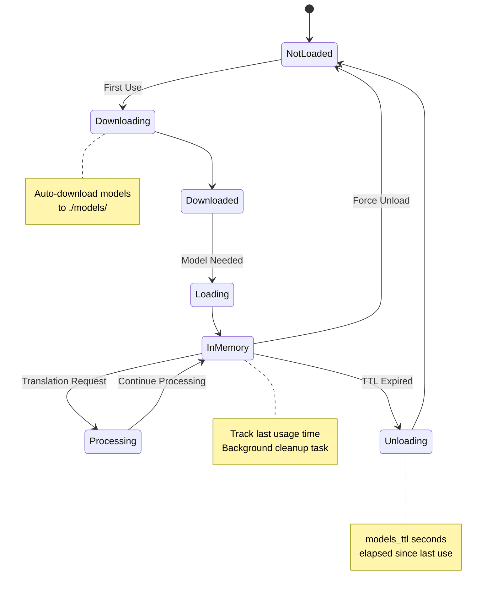
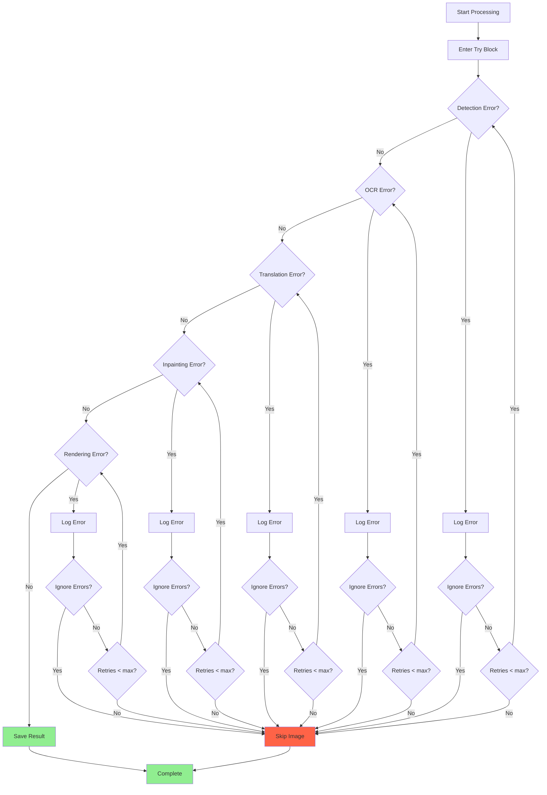
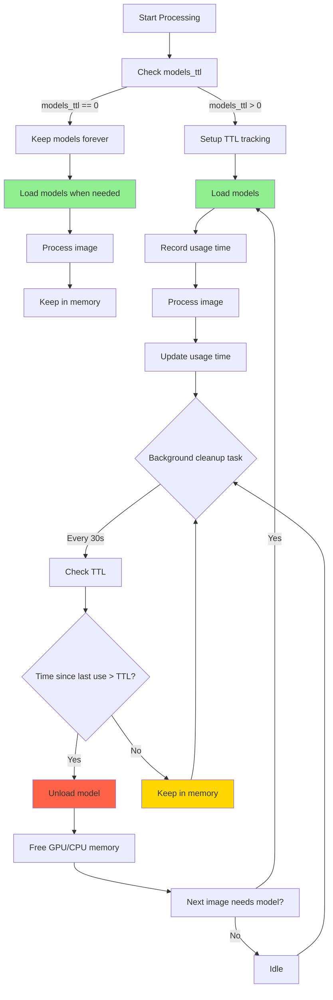

# Manga Image Translator - Flow Diagrams

## 📊 Diagram 1: Tổng Quan Pipeline



---

## 📊 Diagram 2: Context Object Flow



---

## 📊 Diagram 3: Web Server Architecture

```mermaid
graph TB
    subgraph "Client Layer"
        C1[Web Browser]
        C2[Mobile App]
        C3[API Client]
    end
    
    subgraph "Web Server (FastAPI)"
        WS[Main Server<br/>server/main.py]
        
        subgraph "API Endpoints"
            E1[/translate/image]
            E2[/translate/image/stream]
            E3[/translate/batch/json]
            E4[/queue-size]
        end
        
        subgraph "Request Processing"
            RE[Request Extraction<br/>server/request_extraction.py]
            TQ[Task Queue<br/>server/myqueue.py]
        end
        
        subgraph "Streaming"
            ST[Streaming Handler<br/>server/streaming.py]
            SD[Sent Data Internal<br/>server/sent_data_internal.py]
        end
    end
    
    subgraph "Translation Instances"
        subgraph "Instance Manager"
            IM[Executor Instances<br/>server/instance.py]
        end
        
        subgraph "Translation Workers"
            TW1[Translator Instance 1]
            TW2[Translator Instance 2]
            TW3[Translator Instance 3]
        end
    end
    
    subgraph "Core Processing"
        MT[MangaTranslator<br/>manga_translator/manga_translator.py]
        
        subgraph "Processing Modules"
            DET[Detection]
            OCR[OCR]
            TRANS[Translation]
            INP[Inpainting]
            REND[Rendering]
        end
    end
    
    C1 --> E1
    C2 --> E2
    C3 --> E3
    
    E1 --> RE
    E2 --> RE
    E3 --> RE
    
    RE --> TQ
    TQ --> IM
    IM --> TW1
    IM --> TW2
    IM --> TW3
    
    TW1 --> MT
    TW2 --> MT
    TW3 --> MT
    
    MT --> DET
    DET --> OCR
    OCR --> TRANS
    TRANS --> INP
    INP --> REND
    
    REND --> SD
    SD --> ST
    ST --> C1
    
    style WS fill:#4169E1,color:#FFF
    style MT fill:#32CD32,color:#FFF
    style TQ fill:#FF6347,color:#FFF
    style IM fill:#FFD700,color:#000
```

---

## 📊 Diagram 4: Task Queue Flow



---

## 📊 Diagram 5: Translation Pipeline Sequence



---

## 📊 Diagram 6: Batch Translation Flow



---

## 📊 Diagram 7: Stream Format Structure



---

## 📊 Diagram 8: Model Lifecycle



---

## 📊 ASCII Art: Pipeline Flow

```
┌─────────────────────────────────────────────────────────────────┐
│                    MANGA IMAGE TRANSLATOR                       │
└─────────────────────────────────────────────────────────────────┘

                        ┌─────────────┐
                        │ INPUT IMAGE │
                        │  (PIL.Image)│
                        └──────┬──────┘
                               │
                               ▼
                    ┌─────────────────────┐
                    │ 1. COLORIZATION      │ (Optional)
                    │    Apply colorizer   │
                    └──────┬───────────────┘
                           │
                           ▼
                    ┌─────────────────────┐
                    │ 2. UPSCALING         │ (Optional)
                    │    Enhance resolution │
                    └──────┬───────────────┘
                           │
                           ▼
        ┌───────────────────────────────────────┐
        │ 3. DETECTION - Find Text Regions      │
        │    - Detector models (DB, CTD, etc)   │
        │    Output: text_regions, panels        │
        └──────┬────────────────────────────────┘
               │
               ▼
        ┌───────────────────────────────────────┐
        │ 4. OCR - Extract Text                  │
        │    - 48px, 32px, Manga OCR             │
        │    Output: TextLine objects            │
        └──────┬────────────────────────────────┘
               │
               ▼
        ┌───────────────────────────────────────┐
        │ 5. TEXTLINE MERGE                      │
        │    - Combine related lines             │
        │    - Group by bubbles/panels          │
        └──────┬────────────────────────────────┘
               │
               ▼
        ┌───────────────────────────────────────┐
        │ 6. TRANSLATION                         │
        │    - Pre-dict replacement              │
        │    - Online/Offline translators       │
        │    - Post-dict replacement            │
        │    Output: translated texts           │
        └──────┬────────────────────────────────┘
               │
               ▼
        ┌───────────────────────────────────────┐
        │ 7. MASK REFINEMENT                     │
        │    - Expand text masks                 │
        │    - Smooth edges                      │
        └──────┬────────────────────────────────┘
               │
               ▼
        ┌───────────────────────────────────────┐
        │ 8. INPAINTING - Remove Old Text        │
        │    - LaMa, Stable Diffusion            │
        │    Output: image without text          │
        └──────┬────────────────────────────────┘
               │
               ▼
        ┌───────────────────────────────────────┐
        │ 9. RENDERING - Add New Text           │
        │    - Font selection & sizing          │
        │    - Color detection                   │
        │    - Alignment                         │
        │    Output: FINAL IMAGE                 │
        └──────┬────────────────────────────────┘
               │
               ▼
                    ┌─────────────┐
                    │OUTPUT IMAGE │
                    └─────────────┘
```

---

## 📊 ASCII Art: Web Server Flow

```
┌──────────────────────────────────────────────────────────────────────┐
│                          WEB SERVER ARCHITECTURE                     │
└──────────────────────────────────────────────────────────────────────┘

    ┌──────────────┐
    │   Client     │
    │ (Browser/App)│
    └──────┬───────┘
           │ HTTP POST
           ▼
    ┌────────────────────────────────────┐
    │        FastAPI Server               │
    │     server/main.py                  │
    │                                     │
    │  ┌──────────────────────┐          │
    │  │  API Endpoints:      │          │
    │  │  • /translate/image  │          │
    │  │  • /translate/json   │          │
    │  │  • /batch/json       │          │
    │  └──────────┬───────────┘          │
    │             │                       │
    │             ▼                       │
    │  ┌──────────────────────┐          │
    │  │ Request Extraction   │          │
    │  │ request_extraction.py│          │
    │  └──────────┬───────────┘          │
    └──────────────┼──────────────────────┘
                   │
                   ▼
    ┌──────────────────────────────────────┐
    │         Task Queue Manager            │
    │         myqueue.py                    │
    │                                       │
    │  QueueElement:                       │
    │  - image: PIL.Image                  │
    │  - config: Config                    │
    │  - req: Request                      │
    └───────────┬──────────────────────────┘
                │
                │ Wait for executor
                ▼
    ┌──────────────────────────────────────┐
    │     Executor Instance Manager         │
    │         instance.py                   │
    │                                       │
    │  ┌─────────┐  ┌─────────┐  ┌───────┐│
    │  │ Exec 1  │  │ Exec 2  │  │Exec 3 ││
    │  └─────────┘  └─────────┘  └───────┘│
    └───────────┬──────────────────────────┘
                │
                │ Assign task
                ▼
    ┌──────────────────────────────────────┐
    │      Translation Worker               │
    │    MangaTranslator                   │
    │                                       │
    │  ┌─────────────────────┐             │
    │  │  Full Pipeline:    │             │
    │  │  1. Detection      │             │
    │  │  2. OCR            │             │
    │  │  3. Translation    │             │
    │  │  4. Inpainting     │             │
    │  │  5. Rendering      │             │
    │  └─────────────────────┘             │
    └───────────┬──────────────────────────┘
                │
                │ Result
                ▼
    ┌──────────────────────────────────────┐
    │       Streaming Handler               │
    │       streaming.py                   │
    │                                       │
    │  Format chunks:                      │
    │  [status(1)][size(4)][data(N)]      │
    └───────────┬──────────────────────────┘
                │
                │ Stream chunks
                ▼
    ┌──────────────┐
    │   Client     │
    │  Receives    │
    │  Result      │
    └──────────────┘
```

---

## 📊 ASCII Art: Context Data Flow

```
┌────────────────────────────────────────────────────────────────────┐
│                      CONTEXT OBJECT - DATA FLOW                    │
└────────────────────────────────────────────────────────────────────┘

Create Context:
    ctx = Context(input=image)
    └─> ctx.input: PIL.Image
        └─> Original input image
    
    ▓▓▓▓▓▓▓▓▓▓▓▓▓▓▓▓▓▓▓▓▓▓▓▓▓▓▓▓▓▓▓▓▓▓▓▓▓▓▓
    │ CONTEXT OBJECT                      │
    │                                     │
    ├─ Step 1: Detection                 │
    │  ├─> ctx.text_regions: []          │
    │  │   └─> List of detected polygons │
    │  └─> ctx.panels: []                 │
    │      └─> List of panel regions      │
    │                                     │
    ├─ Step 2: OCR                        │
    │  └─> ctx.textlines: [TextLine]     │
    │      ├─ TextLine.text: "原文"       │
    │      ├─ TextLine.bbox: (x,y,w,h)   │
    │      └─ TextLine.translation: ""   │
    │                                     │
    ├─ Step 3: Translation               │
    │  └─> ctx.textlines[].translation = "Translation"
    │                                     │
    ├─ Step 4: Inpainting                │
    │  └─> ctx.inpaint_result: PIL.Image │
    │                                     │
    ├─ Step 5: Rendering                  │
    │  └─> ctx.result: PIL.Image         │
    │      └─> FINAL OUTPUT              │
    ▓▓▓▓▓▓▓▓▓▓▓▓▓▓▓▓▓▓▓▓▓▓▓▓▓▓▓▓▓▓▓▓▓▓▓▓▓
```

---

## 📊 Mermaid: Error Handling Flow



---

## 📊 Mermaid: Model TTL System



---

## 📊 Summary Table: Module Responsibilities

| Module | Location | Responsibility | Dependencies |
|--------|----------|----------------|-------------|
| **MangaTranslator** | `manga_translator.py` | Main orchestrator | All modules |
| **Detection** | `detection/*.py` | Find text regions | DB, CTD models |
| **OCR** | `ocr/*.py` | Extract text | OCR models (48px, etc) |
| **Translation** | `translators/*.py` | Translate text | API services, models |
| **Inpainting** | `inpainting/*.py` | Remove old text | LaMa, SD models |
| **Rendering** | `rendering/*.py` | Add new text | PIL, Pillow |
| **Config** | `config.py` | Configuration | Omegaconf |
| **Queue** | `server/myqueue.py` | Task management | asyncio |
| **Server** | `server/main.py` | HTTP interface | FastAPI |

---

## 📊 Usage Examples

### Example 1: Local Batch Mode
```bash
python -m manga_translator local \
    -i /path/to/images \
    -o /path/to/output \
    --use-gpu \
    -v
```

### Example 2: Web Server
```bash
# Terminal 1: Start web server
python server/main.py --start-instance --use-gpu

# Terminal 2: Upload via curl
curl -X POST http://localhost:8000/translate/with-form/image/stream \
    -F "image=@image.png" \
    -F "config={\"translator\":{\"translator\":\"sugoi\"}}"
```

### Example 3: Python API
```python
from manga_translator import MangaTranslator
from manga_translator import Config

translator = MangaTranslator({
    'use_gpu': True,
    'verbose': True
})

config = Config()
config.translator.translator = 'sugoi'
config.translator.target_lang = 'ENG'

result = await translator.translate_path(
    'input.png', 
    'output.png', 
    vars(config)
)
```

---

## 🔗 Related Files

- **Main Flow**: `manga_translator/manga_translator.py`
- **Context**: `manga_translator/utils/generic.py:28-72`
- **Detection**: `manga_translator/detection/`
- **OCR**: `manga_translator/ocr/`
- **Translation**: `manga_translator/translators/`
- **Inpainting**: `manga_translator/inpainting/`
- **Rendering**: `manga_translator/rendering/`
- **Server**: `server/main.py`
- **Queue**: `server/myqueue.py`

---

*Generated diagrams for Manga Image Translator project*


